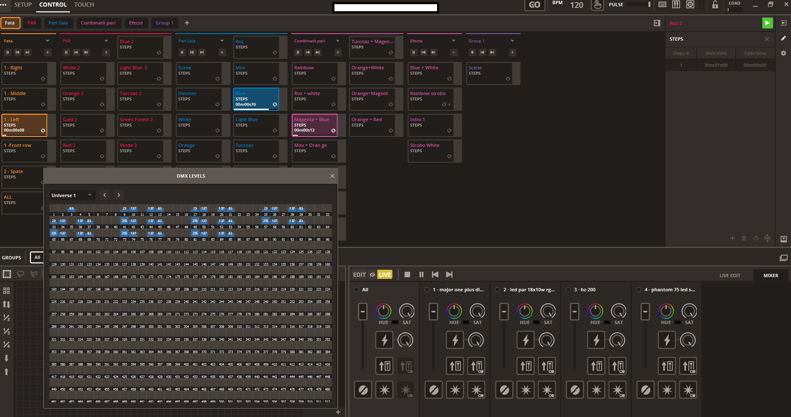
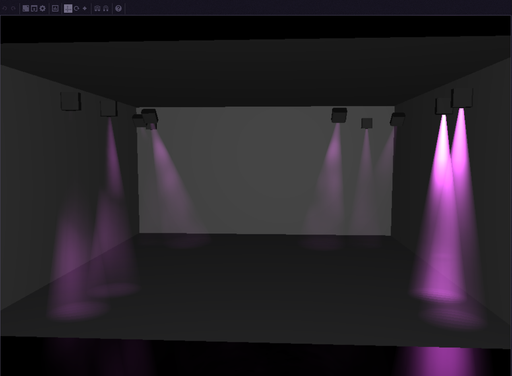
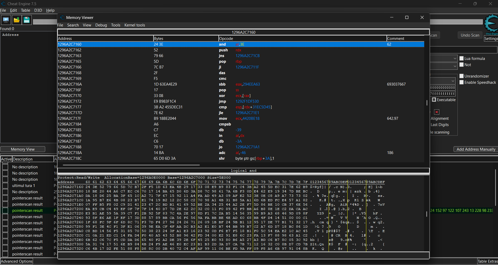
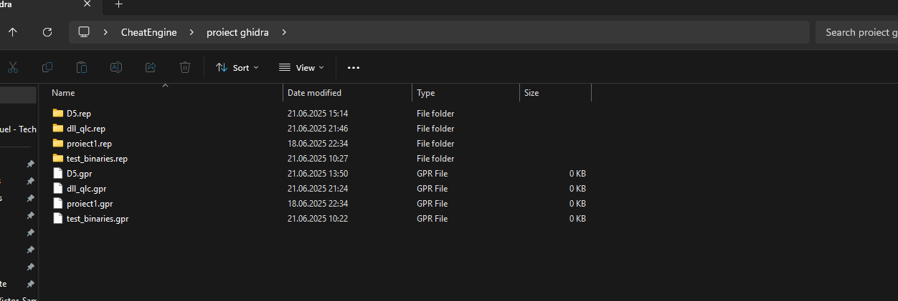
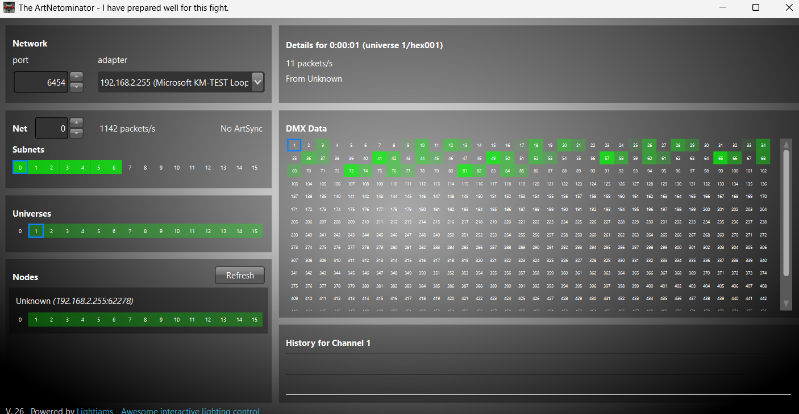

# Art-Net DMX Bridge — Cititor de Memorie Proces

Un proiect de cercetare și educațional care demonstrează modul de extragere a datelor de iluminat DMX dintr-un proces Windows activ, folosind analiza lanțurilor de pointeri și decriptarea XOR, urmată de transmiterea acestora prin protocolul Art-Net.

Acest proiect a fost realizat ca un studiu personal aprofundat în structura internă a Windows (internals), instrumente de reverse engineering și protocoale de iluminat pentru scenă.

---

## Ce face acest instrument

Un controller de iluminat care rulează pe Windows păstrează datele universurilor DMX în memorie. Valorile sunt ușor obfuscate: fiecare byte este combinat prin XOR cu un byte corespunzător dintr-un buffer de chei stocat în altă parte a aceluiași proces.

Interfața software-ului țintă afișează nivelurile DMX live înainte de obfuscare:

Acest instrument:
1. **Localizează procesul țintă** după titlul ferestrei.
2. **Rezolvă lanțurile de pointeri** multi-nivel pentru a găsi bufferele de date DMX (unul per univers) și buffer-ul cheii XOR.
3. **Decriptează datele** folosind cheia XOR identificată.
4. **Aplică un filtru de glitch** per canal pentru a elimina valorile de zero parazite.
5. **Transmite rezultatul** ca pachete UDP standard Art-Net ArtDMX la aproximativ 40 FPS.

Abordarea este exclusiv de tip **read-only** — nimic nu este scris înapoi în proces. Acest lucru permite datelor extrase să alimenteze software-uri externe de vizualizare 3D în timp real:

---

## Cum a fost descoperită structura internă

Structura memoriei a fost mapată folosind o combinație de instrumente de analiză dinamică și statică:

### Extragerea Pointerilor și Analiza Memoriei Live
**Cheat Engine** a fost utilizat pentru atașarea la proces, scanarea valorilor DMX live și urmărirea lanțurilor de pointeri până la o adresă de bază stabilă dintr-un DLL încărcat. Acest lucru a permis identificarea instrucțiunilor specifice care gestionează obfuscarea datelor.

### Analiza Binară Statică
**Ghidra** a fost utilizată pentru dezasamblarea binarului, confirmarea tiparelor de dereferențiere a pointerilor și identificarea operațiunii XOR folosite pentru obfuscare. Fișierele de proiect arată maparea zonelor de memorie și a structurilor de cod.

* **Aritmetică manuală a offset-urilor**: Universurile sunt așezate la un pas predictibil ($0x18 + 0x8 \times indice\_univers$) în cadrul aceluiași arbore de pointeri.

---

## Obfuscarea XOR

Controllerul stochează valorile DMX sub o formă XOR-ată. Cheia este un alt buffer din memorie, accesibil printr-un lanț separat de pointeri. Decriptarea este o simplă operațiune XOR byte-cu-byte:

$$dmx\_value = raw\_byte \oplus key\_byte$$

Buffer-ul cheii rămâne stabil pe toată durata sesiunii, fiind salvat o singură dată la pornire.

---

## Protocolul Art-Net și Validarea

### Dovadă de Concept (PoC) Externă
Pentru a dovedi eficiența acestui bridge, a fost utilizat **ArtNetominator** (un instrument gratuit de diagnoză externă) pentru a monitoriza rețeaua. Acesta oferă o verificare independentă a faptului că datele extrase și decriptate sunt transmise corect sub formă de pachete standard ArtDMX.

---

## Configurare

Parametrii principali pot fi modificați în partea de sus a scriptului `artnet_bridge.py`:

| Variabilă | Valoare Implicită | Descriere |
| :--- | :--- | :--- |
| `WINDOW_TITLE` | `"LightingController"` | Titlul ferestrei procesului țintă |
| `ARTNET_IP` | `"192.168.2.255"` | Adresa de broadcast a rețelei |
| `SEND_INTERVAL` | `0.025` | Intervalul între cadre (40 FPS) |
| `UNIVERSE_COUNT` | `100` | Numărul de universuri procesate |
| `MAX_ZERO_FRAMES` | `2` | Pragul filtrului pentru valori de zero |

---

## Filtru de Glitch

Echipamentele DMX pot reacționa vizibil la un singur cadru eronat de tip "zero". Filtrul implementat păstrează ultima valoare non-zero cunoscută dacă secvența de zero este mai scurtă de `MAX_ZERO_FRAMES`. Secvențele mai lungi sunt tratate ca "blackout" intenționat.

---

## Limitarea Răspunderii (Disclaimer)

Acest proiect are scop educațional. Utilizarea acestui script trebuie să se facă exclusiv pe aplicații asupra cărora aveți drepturi depline de acces. Autorul nu își asumă responsabilitatea pentru încălcarea termenilor de utilizare ai altor software-uri.

---

## Licență
MIT